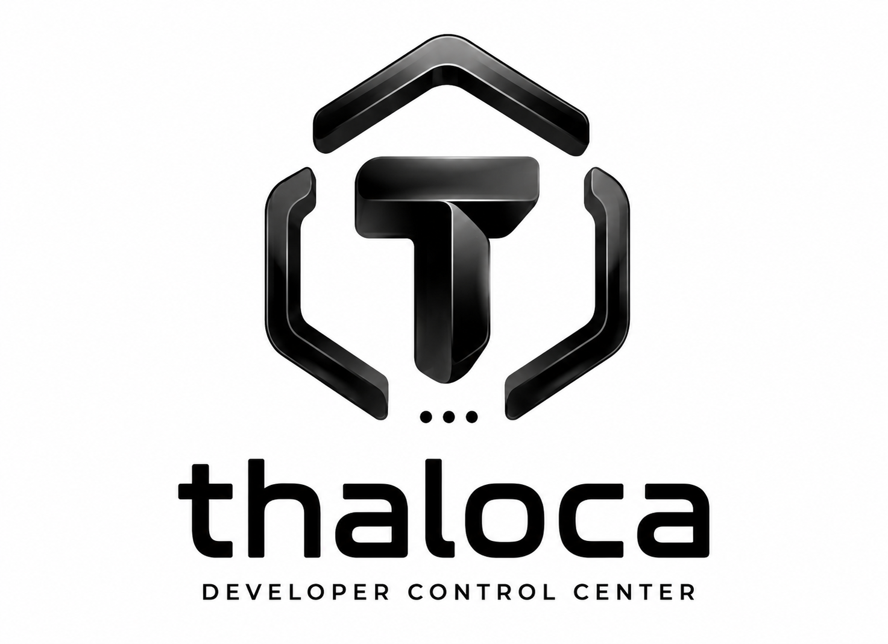
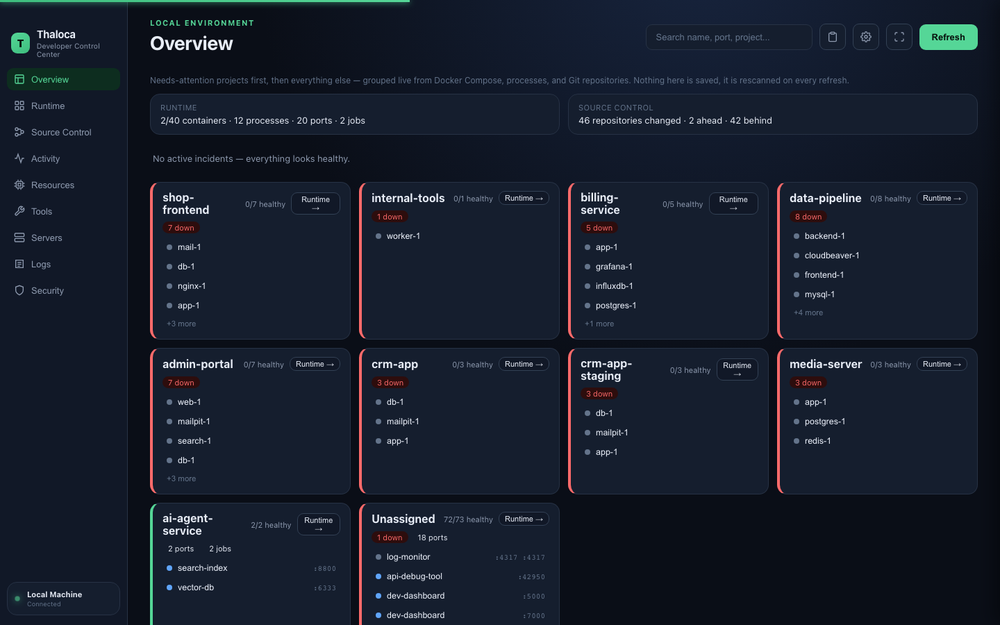
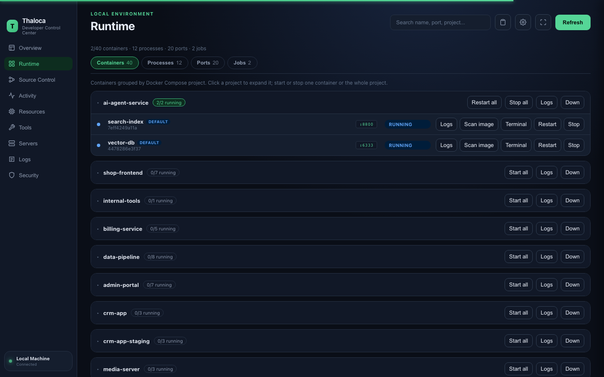
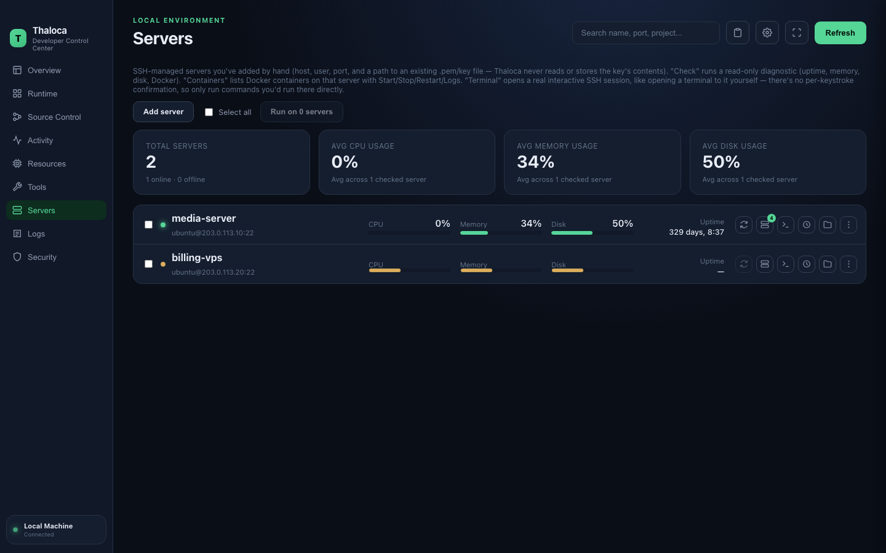

<p align="center"></p>

Thaloca is a local-first developer control center for macOS. Open it and it
auto-discovers your local dev environment — Docker containers, processes,
ports, background jobs, Git repos, and remote servers — no manifest or setup
step required.

## Screenshots

| Overview | Runtime | Servers |
| --- | --- | --- |
|  |  |  |

## Features

**Runtime discovery**
- Docker containers (grouped by Compose project), local processes, listening
  ports, and background jobs (cron/launchd/PM2/Docker), each with Start/Stop/
  Restart/Logs actions and confirmation on anything destructive.
- HTTP/TCP/TLS health checks against common endpoints (`/health`, `/healthz`,
  `/ready`, `/live`, `/actuator/health`, `/ping`, `/`).
- Overview groups everything into per-project cards (via Docker Compose's own
  project label) and surfaces an anomaly strip for restart loops, degraded
  health, PM2 `errored` jobs, and log-pattern errors (panics/OOM/repeated
  failures) scanned from container logs.

**Source Control** — works like SourceTree: stage/unstage, per-file colored
diffs, commit, conflict resolution ("ours"/"theirs"), commit graph across
branches, Fetch/Pull/Push/Stash. GitHub login via OAuth device flow (or reuses
an active `gh auth` session) powers a full Pull Requests tab: list with
filters/search, Conversation/Commits/Checks/Files-changed detail, inline
review comments on a GitHub-style split diff, merge/squash/rebase.

**Activity** — per-project commit history and a lightweight quality score,
matched to each repo's own Git identity so multi-account machines stay
accurate. Optional opt-in commit/push tracking via local Git hooks.

**Resources** — live CPU/memory/disk/network/GPU usage, a full process list
(sortable, killable), installed-apps scan with CPU/Mem and open/quit actions,
and a 24h sampled history (sparkline charts + a memory-leak heuristic).

**Tools** — detects installed package managers/CLIs and their versions, flags
a project's manifest asking for a tool that isn't installed, and offers
one-click Install/Update through Homebrew (with the exact command shown
before running).

**Servers** — SSH-managed remote hosts: structured health checks (polled
automatically in the background, with a notification if a server drops
offline or its CPU/memory/disk stays under pressure), key permission
warnings, remote Docker container management, a real interactive terminal
(PTY over SSH, xterm.js), remote crontab viewing/enable/disable/remove, a
file browser with upload/download (`scp`), running one command across
several selected servers at once, importing hosts from `~/.ssh/config`, and
ProxyJump/bastion host support. Only a key file *path* is ever stored, never
its contents.

**Cross-cutting** — native notifications (with quiet hours) for problems that
need attention, a port-conflict assistant, clipboard copy history (in-app and
system-wide, auto-expiring after 24h), a global command palette (`Cmd+K`),
config export/import, and a check-for-update notice (see Packaging).

Closing the window hides Thaloca rather than quitting it — background
scanning keeps running; Cmd+Q or the Dock icon's Quit exits fully.

## Packaging

```bash
cd desktop
wails build
./build/package-dmg.sh
```

Produces `desktop/build/bin/Thaloca.dmg` via `hdiutil` (no extra tooling).
Code-signing is ad-hoc only (no Apple Developer ID/notarization), so a
downloaded copy shows Gatekeeper's "unidentified developer" warning —
right-click → Open once, or `xattr -cr /Applications/Thaloca.app`. Update
checking only links to the latest GitHub release; it doesn't auto-install.

## Development

```bash
cd desktop
wails dev    # live dev
wails build  # production build
```

## License

MIT — see [LICENSE](LICENSE).
